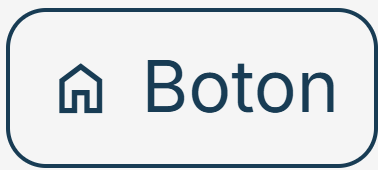

# ⚠️ Advertencia: 🚨

Debido a que la IA no conoce las convenciones ni la arquitectura de este proyecto, antes de hacer preguntas a una IA (Chat GPT, Claude, Gemini, etc.), primero debes copiar y pegar completo este README.md en la IA para que las respuestas de la IA y el código generado sigan las buenas prácticas y se alineen correctamente con la arquitectura del proyecto.

Desobedecer esta advertencia hace que el código generado sea desordenado, inconsistente y no siga las convenciones definidas en el proyecto.

# ⚛️ Next JS 15 + React 19 + Prime React 10 + React Hook Form + Tailwind 4 + Sass + Zustand 

usar Node JS 24.15.0

## 📦 Instalar paquetes

```console
npm i
```

# ▶️ Ejecutar proyecto

comando                | apunta a...   | ruta archivo
---------------------- | ------------- | -------------
node --run start:local | local host    | `environments/.env.localhost`
node --run start:test  | pruebas       | `environments/.env.test`
node --run start:prod  | producción    | `environments/.env.production`

## 🚀 Generar build (dist) para desplegar

comando               | apunta a...   | ruta archivo
--------------------- | ------------- | -------------
node --run build:test | pruebas       | `environments/.env.test`
node --run build:prod | producción    | `environments/.env.production`

# 📁  Estructura de carpetas

ESTO HAY Q CORREGIRLO:
- ACTUALIZARLO POR LAS NUEVAS CARPETAS

- USAR ARBOL JERARQUICO DE ARCHIVOS Y CARPETAS CON ├── Y └──

* **/environments**: Variables de entorno .env para desarrollo (local host), produccion y pruebas

* **src/app/**: Enrutado de Next JS

* **src/components**: Componentes generales que se pueden re-utilizar en cualquier parte de la aplicacion

* **src/components/GeneralErrorMessage.tsx**: Componente que muestra los mensajes de error asociados a un campo de un formulario de React Hook Form

* **src/scss**: Estilos globales de Sass

* **src/types/constant**: Constantes

* **src/types/interface**: Interface asociadas a las constantes

* **src/utils/func/general.ts**: Funciones generalres que se pueden re-utilizar en cualquier parte de la aplicacion

* **src/utils/func/sessionStorage.ts**: Funciones para guardar, listar, actualizar y eliminar propiedad:valor en sessionStorage, codifica y de-codifica en base 64, detecta cuando usar JSON.stringify() y JSON.parse()

* **public/assets/icon**: Iconos

* **public/assets/img**: Imagenes

* **src/store**: Estado global en Zustand para compartir estados entre componentes

* **src/api/generalServiceHttp.ts**: Funcion general para hacer peticiones HTTP usando fetch, sirve para Server Side Rendering y "use client"

# 📅 Fechas

Usar la librería **Luxon** para el manejo de fechas. **NO** usar `new Date()` **NI** librerías como Moment.js.

Esto se debe a que:

* `new Date()` tiene comportamientos inconsistentes entre zonas horarias.

* `new Date()` Es difícil de formatear y manipular de forma segura.

* `new Date()` No maneja bien timezones ni conversiones complejas.

* [Moment.js está en modo legacy/deprecado y ya no se recomienda para proyectos modernos.](https://momentjs.com/docs/#/-project-status/)

* Luxon ofrece una API más clara, moderna y robusta para fechas, tiempos y zonas horarias.

***❌ Incorrecto - usar `new Date()`***

```ts
const now = new Date();
const formatted = now.toLocaleDateString();
```

***❌ Incorrecto - usar moment.js***

```ts
import moment from 'moment';

const today = moment().format('YYYY-MM-DD');
```

***✅ Correcto - usar Luxon***

```ts
import { DateTime } from 'luxon';

const now = DateTime.now();
const formatted = now.toFormat('yyyy-MM-dd');
```

En `src\shared\utils\func\luxon.utils.ts` hay funciones para el manejo (formateo) de fecha y hora usando Luxon.

***❌ Incorrecto - NO usar `formatDate`, usar Luxon directo***

Problemas de este enfoque:

* Repetición de código en múltiples componentes

* cada dev formatea fechas de forma distinta, sin estandarización.

```ts
'use client';
import { DateTime } from 'luxon';

export default function MyComponent() {

  const getDate = () => {
    const now = DateTime.now();

    const formatted = now
      .setLocale('es')
      .toFormat('d-LLL-yyyy hh:mm:ss a');

    console.log(formatted);
  };

  return (
      <button onClick={getDate}>
        Mostrar fecha
      </button>
  );
}
```

***✅ Correcto - usar `formatDate`***

```ts
'use client';
import { DateTime } from 'luxon';
import { formatDate } from "@/shared/utils/func/luxon.utils";

export default function MyComponent() {

  const getDate = () => {
    const formatted = formatDate(
      DateTime.now(),
      'd-LLL-yyyy hh:mm:ss a'
    );

    console.log(formatted);
  };

  return (
      <button onClick={getDate}>
        Mostrar fecha
      </button>
  );
}
```

En `src\shared\utils\func\luxon.utils.ts` hay función para obtener fecha y hora actual con formato de fecha y hora personalizada 

***❌ Incorrecto - usar Luxon directamente para obtener fecha y hora actual***

Problemas de este enfoque:

* Repetición de código en múltiples componentes

* cada dev formatea fechas de forma distinta, sin estandarización.

```ts
'use client';
import { DateTime } from 'luxon';

export default function MyComponent() {

  const getCurrentDateTime = () => {
    const now = DateTime.now()
      .setLocale('es')
      .toFormat('d-LLL-yyyy hh:mm:ss a')
      .replace(/\.$/, '');

    const fixed = now
      .replace(/p\.\s?m/gi, 'p.m')
      .replace(/a\.\s?m/gi, 'a.m');

    console.log(fixed);
  };

  return (
      <button onClick={getCurrentDateTime}>
        Mostrar fecha actual
      </button>
  );
}
```

***✅ Ejemplo correcto - usar `luxon.utils.ts`***

```ts
'use client';
import { currentDateAndTime } from "@/shared/utils/func/luxon.utils";

export default function MyComponent() {

  const getCurrentDateTime = () => {
    const current = currentDateAndTime(
      'd-LLL-yyyy hh:mm:ss a'
    );

    console.log(current);
  };

  return (
      <button onClick={getCurrentDateTime}>
        Mostrar fecha actual
      </button>
  );
}
```

# 📝 Formularios

INCOMPLETO- aqui me falta:
* explicar y dar ejemplo incorrecto y correcto de cada uno, se tiene q usar react hook form SIEMPRE  NO usar para formularios 
   * use state para los formulario controlado
   * Formularios no controlados

* usar watch de react hook form, NO usar on change (escribir ejemplo incorrecto y correcto de cada uno)

# 💅 Maquetación

## 🧱 Configuración de Tailwind 4

[Igual que como se muestra en la documentacion](https://tailwindcss.com/blog/tailwindcss-v4#css-first-configuration)

En este proyecto se está utilizando **Tailwind CSS V4**, por lo tanto el archivo `tailwind.config.js` ya no se utiliza y se considera **obsoleto** en esta arquitectura.

La configuración de Tailwind ahora se realiza en el archivo `src/styles/global/library/tailwind.css`

Esto permite centralizar la definición de tokens de diseño (colores, media queries, etc.) sin necesidad de configuración en archivo JavaScript.

***❌ Incorrecto - Configurar Tailwind 3 con `.js`***

```js
/* tailwind.config.js */

module.exports = {
  theme: {
    extend: {
      colors: {
        'primary-color': '#FF0000',
      },
    },
  },
};
```

***✅ Correcto - Configurar Tailwind 4 con `.css`***

```CSS
/* src/styles/global/library/tailwind.css */

@theme {
  --color-primary-color: #FF0000;
}
```

## ⌨️ Configurar Auto-completado y Linter de Tailwind 4

En VS Code o en cualquier editor basado en VS Code (Antigravity, Cursor, Windsurf, etc.), seguir estos pasos;

1. Instalar extensión [Tailwind CSS IntelliSense](https://marketplace.visualstudio.com/items?itemName=bradlc.vscode-tailwindcss)

2. Instalar extensión [Error Lens](https://marketplace.visualstudio.com/items?itemName=usernamehw.errorlens)

3. Abrir el archivo `settings.json`

   - Atajo rápido: `Ctrl + Shift + P`
   - Luego escribir: `Preferences: Open User Settings (JSON)`

4. En `settings.json` agregar esto:

```json
/* Tailwind 4 */

{
  "tailwindCSS.experimental.configFile": "src/styles/global/library/tailwind.css", /* ruta del archivo .css de configuracion de Tailwind 4 */
  "tailwindCSS.emmetCompletions": true,
  "tailwindCSS.includeLanguages": {
      "javascript": "javascript",
      "javascriptreact": "javascriptreact",
      "plaintext": "html",
      "typescript": "typescript",
      "typescriptreact": "typescriptreact"
  },
}
```

## 🎨 Variables de Colores Tailwind y Sass

Las variables con nombres de los colores de **Sass** en `src/styles/global/variable.scss` y **Tailwind** en `src/styles/global/library/tailwind.css` tienen que ser exactamente los mismos

Esto garantiza que los colores sean los mismos entre los estilos globales definidos en Sass y los estilos de cada componente definidos con Tailwind.

****✅ Ejemplo:****

En Sass y Tailwind ambos colores tienen exactamente el mismo nombre `primary-color` y son el mismo color rojo `#FF0000`

```scss
// src/styles/global/variable.scss

// colores de Sass
$primary-color: #FF0000;
```

[Documentación de variables de Tailwind 4](https://tailwindcss.com/blog/tailwindcss-v4#css-theme-variables)

```CSS
/*
src/styles/global/library/tailwind.css

colores de Tailwind */

@theme {
  --color-primary-color: #FF0000;
}
```

## 🤔 ¿Cómo usar Tailwind y Sass juntos?

****❌ Incorrecto:****

Mezclar Sass y Tailwind en un mismo componente es mala práctica porque los estilos de Sass y Tailwind se sobrescriben debido a la especificidad, herencia y cascada de CSS.

Para los estilos esta prohibido lo siguiente:

* Los componentes de React **NO** deben tener archivos propios .scss ni .css

* CSS Modules (`.module.scss` / `.module.css`)

* Styled Components

* No puede existir un único archivo global de Sass donde se escriban directamente los estilos visuales de todos los componentes.

* `<style jsx global>`

* `<style>`

* Estilos en linea

****❌ Ejemplo incorrecto:****

```TSX
// MyComponent.tsx

export default function MyComponent() {
  return (
    <button id="btn-guardar" 
            className="bg-red-600">
      Guardar
    </button>
  );
}
```

```scss
// src/styles/global/global.scss

#btn-guardar {
  background-color: red;
}
```

***✅ Correcto:***

Sass para estilos globales en `src/styles/global/...`

Tailwind para estilos especificos de cada componente en `src/app/...` y `src/shared/components/...`

****✅ Ejemplo Correcto de Sass global:****

```scss
// src/styles/global/scroll-bar.scss

// ocultar barra de scroll, pero hacer q siga funcionando la barra de scroll
.hidden-scrollbar::-webkit-scrollbar {
  display: none;
}
```

```TSX
// MyComponent1.tsx

export function MyComponent1() {
  return (
    <div className="hidden-scrollbar overflow-auto">
      ...
    </div>
  );
}
```

```TSX
// MyComponent2.tsx

export function MyComponent2() {
  return (
    <div className="hidden-scrollbar overflow-auto">
      ...
    </div>
  );
}
```

****✅ Ejemplo Correcto de Tailwind:****

```TSX
// MyComponent.tsx

export function MyComponent() {
  return (
    <button className="bg-red-600">
      Guardar
    </button>
  );
}
```
## 🖼️ Imagenes

Las imagenes se tienen que guardar en `public/assets/img/...`. Ejemplo:

```TSX
// MyComponent.tsx

import Image from 'next/image';
import { FiHome } from "react-icons/fi";

export default function MyComponent() {
  return <Image src='/assets/img/my-image.jpg' alt='icono' width={50} height={50} />
}
```

## 🖼️ Iconos

**NO** instales otra libreria para iconos porque en este proyecto es estandar usar [React Icons](https://react-icons.github.io/react-icons/)

Dar prioridad a usar los iconos de [React Icons](https://react-icons.github.io/react-icons/). Ejemplo:

```TSX
// MyComponent.tsx

import { FiHome } from "react-icons/fi";

export default function MyComponent() {
  return <FiHome />
}
```

No agregar imágenes/SVGs manualmente si el icono ya existe en [React Icons](https://react-icons.github.io/react-icons/)

Cuando el icono no este en React Icons, entonces agregarlo dentro de la carpeta `public/assets/icons/...`. Ejemplo:

```TSX
// MyComponent.tsx

import Image from 'next/image';
import { FiHome } from "react-icons/fi";

export default function MyComponent() {
  return <Image src='/assets/icons/icon.jpg' alt='icono' width={50} height={50} />
}
```

## 🔘 Estilos Globales para Botones

Para que los iconos de los botones funcionen se tiene que usar iconos de [React Icons](https://react-icons.github.io/react-icons/)

***❌ Incorrecto:***

Usar Tailwind para estilos de los botones

```TSX
// MyComponent.tsx

export default function MyComponent() {

  return (
     <button
         className="rounded-2xl bg-blue-500 hover:bg-blue-600 px-4 py-2 text-white disabled:cursor-not-allowed enabled:cursor-pointer">
       Aceptar
     </button>
  )
}
```

***✅ Correcto:***

Siempre se tiene que usar las clases de CSS con los estilos globales para los botones definidos en `src/styles/global/button.scss`

`button.scss` tiene estilos para todos los tipos de botones

A continuación, para cada uno de los botones se muestra como usarlos y se explica sus estilos:

### Boton primario para acciones de confirmacion (guardar, aceptar, si)

  - ❌ icono
  - ✅ texto
  - ❌ borde
  - ✅ fondo

```TSX
// MyComponent.tsx

export default function MyComponent() {

  return (
     <button className="btn-primary">
       Aceptar
     </button>
  )
}
```

**NO** hover


### Boton secundario con borde para acciones de cancelacion (eliminar, cancelar, no)

  - ❌ icono
  - ✅ texto
  - ✅ borde
  - 🖱️ fondo solo se muestra en hover

```TSX
// MyComponent.tsx

export default function MyComponent() {

  return (
     <button className="btn-secondary-with-border">
       Cancelar
     </button>
  )
}
```

**NO** hover


hover


### Boton secundario sin borde para acciones de cancelacion (eliminar, cancelar, no)

  - ❌ icono
  - ✅ texto
  - ❌ borde
  - 🖱️ fondo solo se muestra en hover

```TSX
// MyComponent.tsx

export default function MyComponent() {

  return (
     <button className="btn-secondary-no-border">
       Cancelar
     </button>
  )
}
```

**NO** hover


hover


### Boton con icono y texto sin borde

  - ✅ icono
  - ✅ texto
  - ❌ borde
  - 🖱️ fondo solo se muestra en hover

```TSX
// MyComponent.tsx

import { FiHome } from "react-icons/fi";

export default function MyComponent() {
  return (
     <button className="btn-icon-no-border">
       <FiHome />
       <span>Boton</span>
     </button>
  )
}
```

**NO** hover


hover


### Boton con icono y borde

  - ✅ icono
  - ❌ texto
  - ✅ borde
  - 🖱️ fondo solo se muestra en hover

```TSX
// MyComponent.tsx

import { FiHome } from "react-icons/fi";

export default function MyComponent() {
  return (
     <button className="btn-icon-with-border">
       <FiHome />
     </button>
  )
}
```

**NO** hover


hover


### Boton con icono, texto y fondo

  - ✅ icono
  - ✅ texto
  - ❌ borde
  - ✅ fondo

```TSX
// MyComponent.tsx

import { FiHome } from "react-icons/fi";

export default function MyComponent() {
  return (
     <button className="btn-with-icon-text-background">
       <FiHome />
       <span>Boton</span>
     </button>
  )
}
```

**NO** hover


hover


### Boton con icono, texto y borde

  - ✅ icono
  - ✅ texto
  - ✅ borde
  - 🖱️ fondo solo se muestra en hover

```TSX
// MyComponent.tsx

import { FiHome } from "react-icons/fi";

export default function MyComponent() {
  return (
     <button className="btn-with-icon-text-border">
       <FiHome />
       <span>Boton</span>
     </button>
  )
}
```

**NO** hover



hover


### Boton con icono y texto

  - ✅ icono
  - ✅ texto
  - ❌ borde
  - 🖱️ fondo solo se muestra en hover

```TSX
// MyComponent.tsx

import { FiHome } from "react-icons/fi";

export default function MyComponent() {
  return (
     <button className="btn-with-icon-text-no-border">
       <FiHome />
       <span>Boton</span>
     </button>
  )
}
```

**NO** hover


hover


