# ⚛️ Next JS 16 + React 19 + Prime React 10 + React Hook Form + Tailwind 4 + Sass + Zustand

# 🟢 Versión de Node JS

Este proyecto debe ejecutarse utilizando:

```bash
Node JS 24.16.0
```

# 📦 Instalar paquetes

```console
npm i
```

# ▶️ Ejecutar proyecto

comando                | apunta a...   | ruta archivo
---------------------- | ------------- | -------------
node --run start:local | local host    | `environments/.env.localhost`
node --run start:test  | pruebas       | `environments/.env.test`
node --run start:prod  | producción    | `environments/.env.production`

# 🚀 Generar build (dist) para desplegar

comando               | apunta a...   | ruta archivo
--------------------- | ------------- | -------------
node --run build:test | pruebas       | `environments/.env.test`
node --run build:prod | producción    | `environments/.env.production`

# 🤖 Skill para Uso de IA

> [!WARNING]
> # ⚠️ ****IMPORTANTE**** 🚨
>
> ****Ignorar esta sección ocasionará que la IA genere código que no respete la arquitectura, estructura ni las convenciones del proyecto, produciendo código inconsistentes y desordenadas.****

Para que la IA pueda responder correctamente y respetar la estructura de este proyecto, antes de realizar cualquier pregunta en herramientas de IA como Chat GPT, Claude, Gemini, etc., ***desde aquí en adelante*** debes copiar y pegar completamente este `README.md`

No debes copiar secciones anteriores del `README.md`

Debes copiar únicamente el contenido que se encuentra desde aquí hacia abajo, incluyendo todas las secciones posteriores completas y sin omitir información.

## Stack Frontend del Proyecto

* Next JS 16 con App Router (`app`)
* React 19
* TypeScript 6
* PrimeReact 10
* React Hook Form 7
* Tailwind CSS 4
* Sass (versión moderna con `@use` y `@forward`, no utilizar `@import`)
* Zustand 5
* Luxon
* tailwind-merge
* clsx
* react-icons
* cookies-next

## Reglas Obligatorias para la IA

* No generes análisis, recomendaciones ni comentarios adicionales hasta que empiece a realizar preguntas.

* Todas las respuestas, recomendaciones y fragmentos de código deben respetar obligatoriamente la arquitectura, reglas, patrones y convenciones definidas en este documento.

* No cuestiones, reemplaces, contradigas ni ignores las decisiones de arquitectura definidas en este proyecto.

* Siempre que respondas con código, debes indicar explícitamente la ubicación exacta de cada archivo basándote en la estructura base del proyecto definida en este documento.

* Si existe alguna ambigüedad, falta de contexto o algún aspecto importante de arquitectura, estructura o convenciones que no esté definido, primero debes preguntar antes de asumir una implementación.

* Si durante la conversación recibes instrucciones contradictorias, debes priorizar siempre las reglas y decisiones definidas inicialmente en este documento.

* La arquitectura, reglas y convenciones definidas en este documento tienen prioridad absoluta. Sin embargo, como no todos los casos posibles están documentados, si un problema no puede resolverse respetando la arquitectura actual o requiere una solución no contemplada en el README, primero debes advertir explícitamente que dicha solución se sale de la arquitectura o convenciones establecidas antes de generar una implementación.

# 📁 Estructura Base del Proyecto

# ***ESTO HAY Q CORREGIRLO:***
- ACTUALIZARLO POR LAS NUEVAS CARPETAS

- USAR ARBOL JERARQUICO DE ARCHIVOS Y CARPETAS CON ├── Y └──

```txt
src/
│
└── styles/
    ├── main.scss → con @use importa estilos .scss globales de toda la pagina web, NO debe contener estilos directos
    │
    └── global/ → estilos globales de toda la pagina web
        ├── _reset.scss → elimina los estilos por defecto del navegador para asegurar una apariencia uniforme en todos los navegadores
        ├── _scroll-bar.scss → estilos globales de barra de scroll
        ├── _table.scss → estilos globales para tablas
        ├── _variables.scss → variables globales de Sass
        │
        ├── library/ → estilos que afectan las librerias
        │   ├── _prime-react.scss → estilos que afectan a Prime React
        │   ├── _sweet-alert-2.scss → estilos que afectan a Sweet Alert 2
        │   └── _tailwind.css → archivo de configuración de Tailwind 4
        │
        └── buttons/ → estilos globales de botones organizados en archivos .scss composables que permiten combinar variantes, tamaños, estados y temas
            ├── index-buttons.scss → con @use importa estilos .scss para los botones, NO debe contener estilos directos
            ├── _base.scss → Reset CSS para botones
            ├── _effects.scss → utilidades visuales reutilizables para los botones: box-shadow, blur, elevation (sin lógica UI)
            ├── _modifiers.scss → alteran/extienden características de los botones sin sobrescribir sus estilos principales
            ├── _sizes.scss → Define el tamaño del botón mediante tokens basados en la escala de Tailwind CSS 4 para padding, font-size y line-height.
            ├── _states.scss → estados de boton: hover, active, focus, disabled
            ├── _themes.scss → Define los temas de color del botón mediante CSS Custom Properties generadas a partir de _tokens.scss.
            ├── _tokens.scss → Define los tokens de diseño del sistema de botones mediante variables Sass (colores, tipografía, espaciado y escalas).
            ├── _mixins.scss → codigo de Sass que se repite en diferentes archivos de src\styles\global\buttons
            └── _variants.scss → Variantes visuales (background, outline, ghost, link) que define la apariencia y comportamiento visual según el tipo de botón.
```

# 📅 Fechas

Usar la librería **Luxon** para el manejo de fechas. **NO** usar `new Date()` **NI** librerías como Moment.js.

Esto se debe a que:

* `new Date()` tiene comportamientos inconsistentes entre zonas horarias.

* `new Date()` Es difícil de formatear y manipular de forma segura.

* `new Date()` No maneja bien timezones ni conversiones complejas.

* [Moment.js está en modo legacy/deprecado y ya no se recomienda para proyectos modernos.](https://momentjs.com/docs/#/-project-status/)

* Luxon ofrece una API más clara, moderna y robusta para fechas, tiempos y zonas horarias.

***❌ Incorrecto - usar `new Date()`***

```ts
const now = new Date();
const formatted = now.toLocaleDateString();
```

***❌ Incorrecto - usar moment.js***

```ts
import moment from 'moment';

const today = moment().format('YYYY-MM-DD');
```

***✅ Correcto - usar Luxon***

```ts
import { DateTime } from 'luxon';

const now = DateTime.now();
const formatted = now.toFormat('yyyy-MM-dd');
```

En `src\shared\utils\func\luxon.utils.ts` hay funciones para el manejo (formateo) de fecha y hora usando Luxon.

***❌ Incorrecto - NO usar `formatDate`, usar Luxon directo***

Problemas de este enfoque:

* Repetición de código en múltiples componentes

* cada dev formatea fechas de forma distinta, sin estandarización.

```ts
'use client';
import { DateTime } from 'luxon';

export default function MyComponent() {

  const getDate = () => {
    const now = DateTime.now();

    const formatted = now
      .setLocale('es')
      .toFormat('d-LLL-yyyy hh:mm:ss a');

    console.log(formatted);
  };

  return (
      <button onClick={getDate}>
        Mostrar fecha
      </button>
  );
}
```

***✅ Correcto - usar `formatDate`***

```ts
'use client';
import { DateTime } from 'luxon';
import { formatDate } from "@/shared/utils/func/luxon.utils";

export default function MyComponent() {

  const getDate = () => {
    const formatted = formatDate(
      DateTime.now(),
      'd-LLL-yyyy hh:mm:ss a'
    );

    console.log(formatted);
  };

  return (
      <button onClick={getDate}>
        Mostrar fecha
      </button>
  );
}
```

En `src\shared\utils\func\luxon.utils.ts` hay función para obtener fecha y hora actual con formato de fecha y hora personalizada

***❌ Incorrecto - usar Luxon directamente para obtener fecha y hora actual***

Problemas de este enfoque:

* Repetición de código en múltiples componentes

* cada dev formatea fechas de forma distinta, sin estandarización.

```ts
'use client';
import { DateTime } from 'luxon';

export default function MyComponent() {

  const getCurrentDateTime = () => {
    const now = DateTime.now()
      .setLocale('es')
      .toFormat('d-LLL-yyyy hh:mm:ss a')
      .replace(/\.$/, '');

    const fixed = now
      .replace(/p\.\s?m/gi, 'p.m')
      .replace(/a\.\s?m/gi, 'a.m');

    console.log(fixed);
  };

  return (
      <button onClick={getCurrentDateTime}>
        Mostrar fecha actual
      </button>
  );
}
```

***✅ Ejemplo correcto - usar `luxon.utils.ts`***

```ts
'use client';
import { currentDateAndTime } from "@/shared/utils/func/luxon.utils";

export default function MyComponent() {

  const getCurrentDateTime = () => {
    const current = currentDateAndTime(
      'd-LLL-yyyy hh:mm:ss a'
    );

    console.log(current);
  };

  return (
      <button onClick={getCurrentDateTime}>
        Mostrar fecha actual
      </button>
  );
}
```

# 📝 Formularios en Next JS + React Hook Form + Prime React

## Objetivo
Estandarizar la implementación de formularios escalables, reutilizables y mantenibles en proyectos grandes

---

## Reglas obligatorias del sistema de formularios

### 1. Framework y renderizado
- Se trabaja en Next.js (App Router).
- Todos los componentes de formularios deben ser "use client".

### 2. Ubicación obligatoria de componentes

Es obligatorio usar los componentes reutilizables de inputs ubicados en:

```txt
src/shared/components/react-hook-form
```

---

### 3. Restricciones estrictas
- Prohibido usar inputs HTML nativos (`<input />`, `<select />`, etc.).
- Obligatorio usar componentes de PrimeReact para todos los campos.
- Prohibido usar formularios controlados con `useState`.
- Prohibido usar formularios no controlados con `useRef`.
- React Hook Form es la única fuente válida de estado del formulario.

---

### 4. React Hook Form (RHF)
- Es el único responsable del estado del formulario.
- `defaultValues` se define exclusivamente en `useForm` en el componente padre.
- `watch` es obligatorio para lógica derivada en el componente padre.
- `onChange` manual está prohibido fuera de los inputs controlados por `Controller`.

---

### 5. Uso obligatorio de `watch`

- Toda lógica condicional del formulario debe resolverse con `watch`.

- `watch` **NO** debe usarse dentro de componentes reutilizables de input que estan en `src/shared/components/react-hook-form`

- Prohibido usar `useState` + `onChange` para manejar formularios. Lo correcto es usar `watch` en el componente padre.

- Ejemplos: `disabled`, visibilidad, dependencias entre campos.

---

### 6. Componentes reutilizables
Un input reutilizable debe:
- Encapsular `Controller` de React Hook Form.
- Ser genérico (`T extends FieldValues`).
- Usar `control`, `name`, `rules`, `errors` como contrato base.
- No contener lógica de negocio.
- No definir reglas internas.
- No usar `watch`.
- Representar un único tipo de campo/input.
- No mezclar múltiples tipos de input en un mismo componente reutilizable.

***✅ Correcto***

- `InputText`
- `InputPassword`
- `InputNumber`
- `InputEmail`
- `InputPhone`
- `InputSelect`

***❌ Incorrecto***

- `GenericInput`
- `BaseInput`
- `DynamicInput`
- Un único componente que maneje:
  - `input type="text"`
  - `input type="password"`
  - `input type="number"`
  - `input type="email"`

---

### 7. UI (Prime React)
- PrimeReact solo maneja la capa visual.
- `disabled`, `placeholder`, `className` son props de UI.
- Prime React no puede modificar el estado del formulario.
- Solo refleja el estado final derivado de React Hook Form.

---

### 8. Validaciones
- Todas las validaciones se definen en el padre mediante `rules`.
- Se soportan múltiples validaciones (`required`, `minLength`, `pattern`, etc.).
- El input solo ejecuta las validaciones, no las define.

---

### 9. Formularios dinámicos
- La estructura del formulario debe definirse en el padre (config-driven).
- No se permite lógica condicional dentro de los componentes de input.

---

## Regla clave de arquitectura

* Input (componente hijo) = UI + conexión React Hook Form

* Padre = lógica + `watch` + validaciones + estado derivado

---

## Flujo obligatorio de datos

1. React Hook Form gestiona estado interno.
2. watch en el componente padre define reglas dinámicas.
3. El padre calcula props finales (ejemplo: `disabled`).
4. El input recibe solo valores finales.
5. PrimeReact renderiza UI.

---

## Prohibido

- Usar `watch` dentro de inputs reutilizables.
- Usar `useState` para formularios controlados
- Usar `useRef` para formularios no controlados
- Usar inputs nativos de HTML.
- Mezclar lógica de negocio dentro de inputs.
- Definir `defaultValues` fuera de `useForm`.
- Duplicar control de estado entre RHF y UI.
- Usar `map` para renderizar los campos de los formularios.

---

## Resultado esperado

- Formularios escalables y consistentes.
- Componentes reutilizables reales (design system).
- Cero duplicación de lógica de `Controller`.
- Separación estricta entre lógica y UI.
- Mantenimiento simple en proyectos grandes.

# ***INCOMPLETO - AQUI ME FALTA AGREGAR EJEMPLO DE INPUTS Q ESTAN EN SRC/SHARED/COMPONENTS/REACT-HOOK-FORM***

# 💅 Maquetación

## 🧱 Configuración de Tailwind 4

[Igual que como se muestra en la documentacion](https://tailwindcss.com/blog/tailwindcss-v4#css-first-configuration)

En este proyecto se está utilizando **Tailwind CSS V4**, por lo tanto el archivo `tailwind.config.js` ya no se utiliza y se considera **obsoleto** en esta arquitectura.

La configuración de Tailwind ahora se realiza en el archivo `src/styles/global/library/tailwind.css`

Esto permite centralizar la definición de tokens de diseño (colores, media queries, etc.) sin necesidad de configuración en archivo JavaScript.

***❌ Incorrecto - Configurar Tailwind 3 con `.js`***

```js
/* tailwind.config.js */

module.exports = {
  theme: {
    extend: {
      colors: {
        'primary-color': 'oklch(62.8% 0.258 29.23)',
      },
    },
  },
};
```

***✅ Correcto - Configurar Tailwind 4 con `.css`***

```CSS
/* src/styles/global/library/tailwind.css */

@theme {
  --color-primary-color: oklch(62.8% 0.258 29.23) ;
}
```

## ⌨️ Configurar Auto-completado y Linter de Tailwind 4

En VS Code o en cualquier editor basado en VS Code (Antigravity, Cursor, Windsurf, etc.), seguir estos pasos;

1. Instalar extensión [Tailwind CSS IntelliSense](https://marketplace.visualstudio.com/items?itemName=bradlc.vscode-tailwindcss)

2. Instalar extensión [Error Lens](https://marketplace.visualstudio.com/items?itemName=usernamehw.errorlens)

3. Abrir el archivo `settings.json`

   - Atajo rápido: `Ctrl + Shift + P`
   - Luego escribir: `Preferences: Open User Settings (JSON)`

4. En `settings.json` agregar esto:

```json
/* Tailwind 4 */

{
  "tailwindCSS.experimental.configFile": "src/styles/global/library/tailwind.css", /* ruta del archivo .css de configuracion de Tailwind 4 */
  "tailwindCSS.emmetCompletions": true,
  "tailwindCSS.includeLanguages": {
      "javascript": "javascript",
      "javascriptreact": "javascriptreact",
      "plaintext": "html",
      "typescript": "typescript",
      "typescriptreact": "typescriptreact"
  },
}
```

## 🎨 Variables de Colores Tailwind y Sass

[Documentación de variables de Tailwind 4](https://tailwindcss.com/blog/tailwindcss-v4#css-theme-variables)

Las variables con nombres de los colores de **Sass** en `src/styles/global/variable.scss` y **Tailwind** en `src/styles/global/library/tailwind.css` deben mantener exactamente el mismo nombre y el mismo valor.

Esto garantiza que los colores sean los mismos entre los estilos globales definidos en Sass y los estilos de cada componente definidos con Tailwind.

***✅ Ejemplo Correcto:***

En Sass y Tailwind ambos colores tienen exactamente el mismo nombre `primary-color` y son el mismo valor con color rojo `oklch(62.8% 0.258 29.23)`

```scss
/*
src/styles/global/variable.scss

colores de Sass */
$primary-color: oklch(62.8% 0.258 29.23) ;
```

```CSS
/*
src/styles/global/library/tailwind.css

colores de Tailwind */
@theme {
  --color-primary-color: oklch(62.8% 0.258 29.23) ;
}
```

***❌ Ejemplo Incorrecto:***

Los nombres o valores no coinciden entre Sass y Tailwind.


```scss
/*
src/styles/global/variable.scss

colores de Sass */
$primary-color: oklch(62.8% 0.258 29.23); // color rojo
```

```css
/*
src/styles/global/library/tailwind.css

colores de Tailwind */
@theme {
  --color-brand-primary: oklch(54.6% 0.245 262.881); /* color azul */
}
```

### 🎨 Formato de Colores

Todos los colores del proyecto se definen utilizando el formato `oklch`.

***✅ Ejemplo Correcto***

```scss
oklch(62.8% 0.258 29.23)
```

***❌ Ejemplo Incorrecto***

```scss
/* Hexadecimal */
#FF0000

/* RGB */
rgb(255 0 0)

/* RGBA */
rgba(255 0 0 / 50%)

/* HSL  */
hsl(0 100% 50%)

/* HSLA */
hsla(0, 100%, 50%, 0.5)
```

### 🎨 Tailwind Custom Values

Cuando se utilicen colores mediante valores arbitrarios de Tailwind, el color también debe estar definido en formato `oklch`.

***✅ Ejemplo Correcto***

```tsx
<div className="bg-[oklch(62.8%_0.258_29.23)]"></div>
```

***❌ Ejemplo Incorrecto***

```tsx
{/* Hexadecimal */}
<div className="bg-[#FF0000]"></div>

{/* RGB */}
<div className="bg-[rgb(255_0_0)]"></div>

{/* RGBA */}
<div className="bg-[rgba(255_0_0_/_50%)]"></div>

{/* HSL */}
<div className="bg-[hsl(0_100%_50%)]"></div>

{/* HSLA */}
<div className="bg-[hsla(0,_100%,_50%,_0.5)]"></div>
```

## 🤔 ¿Cómo Usar Tailwind y Sass Juntos?

### ✅ PATRÓN CORRECTO (OBLIGATORIO)

👉 Separación estricta de responsabilidades:

* ***Sass*** para estilos globales en `src/styles/global/...`

```scss
// estilo global para tablas en src/styles/global/_table.scss
@use './variable.scss' as variable;

table {
  width: 100%;
  border-collapse: collapse;
  border-spacing: 0;

  thead,
  tfoot,
  th {
    background-color: variable.$blue-ocean;
    color: oklch(100% 0 0); /* #ffffff */
  }

  // ...
}
```

```tsx
// MyComponent.tsx

import { DataTable } from 'primereact/datatable';
import { Column } from 'primereact/column';

const PRODUCTS = [
  { id: 1, name: 'Laptop', price: 2500 },
  { id: 2, name: 'Mouse', price: 50 },
];

export default function MyComponent() {
  return (
    <DataTable value={PRODUCTS}>
      <Column field="id" header="ID" />
      <Column field="name" header="Nombre" />
      <Column field="price" header="Precio" />
    </DataTable>
  );
}
```

* ***Tailwind*** para estilos especificos de cada componente en: 

* `src/app/...`

* `src/shared/components/...`

* `src/shared/ui/...`

```tsx
// MyComponent.tsx

export default function MyComponent() {
  return (
    <h1 className="text-center text-blue-600">
      Guardar
    </h1>
  );
}
```

### 🚨 PRINCIPIO BASE (INNEGOCIABLE)

* ❌ Tailwind y Sass **NO** se mezclan en la capa de UI
* ❌ **NO** existen overrides entre Sass y Tailwind
* ❌ **NO** se resuelve con especificidad
* ❌ **NO** está permitido usar `!important` ni en Sass ni en Tailwind
* ❌ **NO** se duplican responsabilidades de estilos
* ❌ **NO** se crean estilos visuales en Sass para componentes

👉 Si esto ocurre, la arquitectura está mal diseñada.

### ❌ LOS COMPONENTES DE REACT NO PUEDEN USAR:

* `.scss`
* `.css`
* CSS Modules (`.module.scss`, `.module.css`)
* Styled Components
* `<style jsx>`
* `<style jsx global>`
* `<style>`
* `style={{}}` estilos en línea 
* `import './styles.scss'` Importar archivos .scss
* `import './styles.css'` Importar archivos .css 

### 🚫 En Sass global

Está prohibido:

* Estilos de UI de componentes
* Cards, layouts
* Selectores por ID para componentes
* Overrides de Tailwind
* Diseño de interfaces completas

### 🚨 ANTIPATRÓN - ERROR CRÍTICO

```tsx
// MyComponent.tsx

import styles from './MyComponent.module.scss';

export default function MyComponent() {
  return (
    <>
      <button id="btn-guardar" className="bg-red-600!">
        Guardar
      </button>

      <div className="card">
        Contenido de la card
      </div>

      <section className={styles.panel}>
        Contenido del panel
      </section>

      <style jsx global>{`
        .card {
          background-color: white;
          padding: 16px;
          border-radius: 8px;
          border: 1px solid oklch(92.2% 0.005 264);
        }
      `}</style>
    </>
  );
}
```

```scss
// src/styles/global/global.scss

#btn-guardar {
  background-color: blue !important;
}
```

```scss
// MyComponent.module.scss

.panel {
  background-color: white;
  padding: 1rem;
  border-radius: 0.5rem;
  border: 1px solid oklch(92.2% 0.005 264);
}
```

### ❌ PROHIBIDO USAR `@apply` DE TAILWIND

En estos enlaces el creador de Tailwind explica porque **NO** usar `@apply`:

* [Tutorial](https://x.com/adamwathan/status/1226511611592085504)

* [X (Twitter)](https://x.com/adamwathan/status/1559250403547652097)

Está estrictamente prohibido utilizar la directiva `@apply` de Tailwind.

Esto incluye cualquier uso dentro de archivos:
* `.css`
* `.scss`
* cualquier archivo de estilos globales o de componentes

***❌ EJEMPLO INCORRECTO USANDO  `@apply`***

```scss
/* src/styles/global/global.scss

❌ MAL: usando Tailwind dentro de Sass/CSS con @apply */

.button {
  @apply bg-red-600 text-white px-4 py-2 rounded-lg;
}
```

```tsx
// MyComponent.tsx

export default function MyComponent() {
  return (
    <button className="button">
      Boton
    </button>
  );
}
```

## 🖼️ Ruta de Iconos e Imagenes

Debes crear las siguientes carpetas:

```txt
public/
└── assets/
    ├── icon/
    └── img/
```

***✅ Correcto:***

Al usar las etiquetas `` nativa de HTML y `<Image>` de Next JS, siempre utilizar rutas **absolutas** desde `/assets`.

```tsx
// MyComponent.tsx

import Image from "next/image";

export default function MyComponent() {
  return (
    <Image
      src="/assets/img/logo.png" /* usar slash al principio de /assets */
      alt="Logo"
      width={200}
      height={200}
    />
  );
}
```

***❌ Incorrecto***

**NO** usar rutas relativas para acceder a imágenes e iconos.

```tsx
// MyComponent.tsx

import Image from "next/image";

export default function MyComponent() {
  return (
    <Image
      src="../../../assets/img/logo.png" /* es incorrecto porque se escribe ../ */
      alt="Logo"
      width={200}
      height={200}
    />
  );
}
```

```tsx
// MyComponent.tsx

import Image from "next/image";

export default function MyComponent() {
  return (
    <Image
      src="assets/img/logo.png" /* es incorrecto porque NO se escribio el slash al principio de assets */
      alt="Logo"
      width={200}
      height={200}
    />
  );
}
```

### Imagenes

Las **imagenes** se tienen que guardar en `.`. 

```txt
public/assets/img/...
```

Ejemplo:

```TSX
// MyComponent.tsx

import Image from 'next/image';
import { FiHome } from "react-icons/fi";

export default function MyComponent() {
  return <Image src='/assets/img/my-image.jpg' alt='image' width={50} height={50} />
}
```

### Iconos

**NO** instales otra libreria para iconos porque en este proyecto es estandar usar [React Icons](https://react-icons.github.io/react-icons/)

Dar prioridad a usar los iconos de [React Icons](https://react-icons.github.io/react-icons/). Ejemplo:

```TSX
// MyComponent.tsx

import { FiHome } from "react-icons/fi";

export default function MyComponent() {
  return <FiHome />
}
```

No agregar imágenes/SVGs manualmente si el icono ya existe en [React Icons](https://react-icons.github.io/react-icons/)

Cuando el icono no este en [React Icons](https://react-icons.github.io/react-icons/), entonces agregarlo dentro de la carpeta `public/assets/icon/...`.

Los **iconos** del proyecto se deben guardar dentro de la carpeta 

```txt
public/assets/icon/...
```

Ejemplo:

```TSX
// MyComponent.tsx

import Image from 'next/image';
import { FiHome } from "react-icons/fi";

export default function MyComponent() {
  return <Image src='/assets/icon/icon.jpg' alt='icono' width={50} height={50} />
}
```

## 🔘 Estilos Globales para Botones

Está guía de estilos para botones está basada en:

- [Arquitectura de Bootstrap 5.3 para botones](https://getbootstrap.com/docs/5.3/components/buttons/)

- [Tailwind 4 font-size](https://tailwindcss.com/docs/font-size)

- [Tailwind 4 line-height](https://tailwindcss.com/docs/line-height)

- [Tailwind 4 padding](https://tailwindcss.com/docs/padding)

La arquitectura está diseñada para proyectos grandes y escalables, separando responsabilidades.

**❌ Incorrecto:**

Usar los [botones de Prime React](https://primereact.org/button/):

* Componente `Button`

* Props visuales del componente: `severity`, `outlined`, `label`, `icon`, `severity`, `size`, etc.

```tsx
import { Button } from 'primereact/button';

export default function MyComponent() {
  return (
    <Button
      label="Guardar"
      icon="pi pi-check"
      severity="success"
      size="large"
      rounded
      raised
      text
    />
  );
}
```

La razón es que los [botones de Prime React](https://primereact.org/button/) agregan estilos por defecto que alteran los estilos globales de `index-buttons.scss`

**✅ Correcto:**

Usar etiqueta `button` nativa de HTML:

```tsx
import { Button } from 'primereact/button';
import { MdArrowForward } from 'react-icons/md';

export default function MyComponent() {
  return (
    <>
    <button className="btn btn-primary btn-background">
       Primary
    </button>

    <button className="btn btn-secondary btn-background">
      <MdArrowForward />
      <span className="material-symbols-outlined">arrow_forward</span>
    </button>
    </>
  );
}
```

**❌ Incorrecto:**

Usar etiquetas `` para iconos porque las imágenes no se integran correctamente con la arquitectura CSS de los botones y dificultan aplicar estilos dinámicos como:

- `color`
- `hover`
- `active`
- `disabled`
- `font-size`
- dark mode

Esto rompe la consistencia visual y vuelve el código más difícil de mantener y escalar.

```tsx
<button>
  
</button>
```

Por ejemplo, para intentar cambiar color, tamaño o estados visuales de imágenes ``, normalmente se termina recurriendo a hacks visuales con CSS, lo cual es mala práctica:

```SCSS
// cambiar tamaño de imagen
button {
  img {
    display: inline-block;
    width: 20px;
    height: 20px;
  }
}
```

```SCSS
// cambiar color de imagen
img {
  filter: brightness(0) saturate(100%) invert(100%);
}
```

```SCSS
// Recortar la imagen usando la forma del SVG
img {
  mask-image: url(icon.svg);
}
```

```SCSS
// Hacer imagen semitransparente al pasar el mouse
button {
  &:hover {
    img {
      opacity: 0.5;
    }
  }
}
```

Esto genera:

- Son difíciles de mantener.
- Generan inconsistencias visuales.
- Complican los estilos para los estados del botón.
- Rompen fácilmente en dark mode.
- Vuelven el CSS más complejo y frágil.

**✅ Correcto:**

Los iconos de los botones deben utilizar [React Icons](https://react-icons.github.io/react-icons/)

[React Icons](https://react-icons.github.io/react-icons/) funcionan como texto estilizable mediante CSS, lo que permite integrarlos correctamente con la arquitectura visual del proyecto.

```tsx
import { MdArrowForward } from 'react-icons/md';

export default function MyComponent() {
  return (
    <button className="btn btn-primary btn-outline btn-icon-only btn-rounded-full btn-shadow">
      <MdArrowForward />
    </button>
  );
}
```

**❌ Incorrecto:**

Usar Tailwind CSS para definir estilos de botones directamente en cada componente, ya que esto genera estilos inconsistentes y no escalables:

```tsx
<button className="rounded-2xl bg-blue-500 hover:bg-blue-600 px-4 py-2 text-white disabled:cursor-not-allowed enabled:cursor-pointer">
  Aceptar
</button>
```

Mezclar las clases globales de botones (`.btn`, `.btn-primary`, `.btn-outline-*`, etc.) con clases de Tailwind CSS.

```tsx
import { MdSave } from "react-icons/md";

export default function MyComponent() {
  return (
    <button className="btn btn-primary bg-red-500 px-10 rounded-full">
      <MdSave />
      <span className="text-blue-500">Guardar</span>
    </button>
  );
}
```

Usar muchas clases de Sass para cada uno de los estilos de los botones, porque mezcla múltiples responsabilidades en una sola clase:

- Icono
- Texto
- Borde

```tsx
import { MdHome } from "react-icons/md";

export default function MyComponent() {
  return (
    <button className="btn-with-icon-text-border">
      <MdHome />
      <span>Boton</span>
    </button>
  );
}
```

Ese enfoque no escala bien, ya que cada nueva combinación obliga a crear más clases:

```SCSS
.btn-with-icon-text-border-loading {}
.btn-with-icon-text-background-lg {}
.btn-with-icon-text-border-disabled {}
```

Esto genera:

- Archivos Sass enormes y difíciles de mantener.
- Duplicación innecesaria de código.
- Inconsistencias visuales.
- Dificultad para reutilizar un estándar de diseño.

**✅ Correcto:**

Las clases de botones deben representar una sola responsabilidad y ser **composables**.

En arquitectura CSS y de componentes, composable significa que una clase puede combinarse con otras clases pequeñas y reutilizables para construir distintos comportamientos sin duplicar código.

Cada clase modifica únicamente una característica específica del botón. Esto permite combinar comportamientos sin duplicar estilos:

| Archivo              | Descripción                                                                                                                                                                  | Ejemplo de código                                                |
|----------------------|------------------------------------------------------------------------------------------------------------------------------------------------------------------------------|------------------------------------------------------------------|
| `index-buttons.scss` | Archivo orquestador. Importa todos los módulos SCSS mediante `@use`. No debe contener estilos CSS, variables ni lógica visual.                                               | `@use "./base.scss";`                                            |
| `_base.scss`         | Define la estructura base del sistema de botones: reset CSS, layout, alineación, box model y estilos fundamentales de `.btn`. Todas las variantes parten de esta clase base. | `.btn {} `                                                       |
| `_variants.scss`     | Define la apariencia principal del botón (fondo, borde y comportamiento visual). Las variantes pueden combinarse con cualquier tema, tamaño o modificador.                   | `.btn-background {} .btn-outline {} .btn-ghost {} .btn-link {} ` |
| `_themes.scss`       | Define los temas de color mediante CSS Custom Properties. Cada tema establece los colores utilizados por las variantes (`solid`, `outline`, `ghost`, etc.).                  | `.btn-primary {} .btn-secondary {} .btn-success {} `             |
| `_sizes.scss`        | Define la escala de tamaños del botón mediante `padding`, `font-size` y `line-height`. Puede combinarse con cualquier variante o tema.                                       | `.btn-xs {} .btn-sm {} .btn-base {} .btn-lg {} `                 |
| `_states.scss`       | Define los estados interactivos y de accesibilidad del botón. Centraliza comportamientos relacionados con `focus-visible`, `hover`, `active` y `disabled`.                   |                                                                  |
| `_effects.scss`      | Contiene utilidades visuales reutilizables independientes de la lógica del botón. Permite agregar efectos opcionales como sombras, blur o elevación.                         | `.btn-shadow {} `                                                |
| `_modifiers.scss`    | Clases composables que alteran o extienden características específicas del botón sin modificar su variante principal.                                                        | `.btn-full-width {} .btn-rounded-full {} .btn-icon-only {}`      |
| `_mixins.scss`       | Codigo de Sass reutilizable que se repite en diferentes archivos de src\styles\global\buttons                                                                                | `@mixin btn-base-size {}`                                        |
| `_tokens.scss`       | Variables globales de Sass utilizadas por todo el sistema de botones. Centraliza colores, tamaños tipográficos y escalas de espaciado para mantener consistencia visual.     | `$primary: oklch(...);`                                          |

### 📖 Manual de Uso para Dar Estilos a Botones

Esta guía explica cómo utilizar correctamente los estilos globales de botones definidos en:

```txt
src/styles/global/buttons
```

### ✨ UI/UX

En el diseño de interfaces (UI/UX), el color de un botón no es solo decorativo:
cada variante representa una intención de acción dentro del sistema.

Esto ayuda al usuario a entender rápidamente qué va a ocurrir antes de hacer clic.

**🔴 Los colores fuertes:**

- Capturan atención.
- Indican importancia.
- El usuario lo identifica como el botón más importante para hacer clic.

**⚪ Los colores suaves o transparentes:**

- Reducen distracción.
- Bajan la jerarquía visual.
- Mantienen el foco en el contenido principal.

**📏 Reglas de UI/UX**

- Solo debe existir 1 acción primaria por pantalla (colores fuertes).
- Las acciones secundarias deben tener menor jerarquía visual (colores suaves).
- Las acciones destructivas deben ser claramente identificables.
- El color no es decoración, es comunicación.

### Clase `.btn` con Estilos Base

La clase `.btn` define los estilos base y actúa como un **reset CSS obligatorio para todos los botones**, sin importar su variante o tipo (`primary`, `outline`, `ghost`, etc.).

Esta clase **siempre debe utilizarse**, ya que establece la estructura común del componente y garantiza consistencia en toda la UI.

Incluye estilos fundamentales como `padding`, `font-size`, alineación del contenido, comportamiento de interacción (`hover`, `active`, `disabled`) y configuración de layout.

Por defecto, `.btn` tiene `background-color: transparent`, por lo que **no representa un botón visual completo por sí sola**. Su función es servir como base para que las variantes (`.btn-primary`, `.btn-outline-*`, etc.) apliquen el estilo visual final.

- Botones **activados** usan `cursor: pointer` 👆🏻 para indicar que el botón es interactivo y puede ser clickeado.

- Botones **desactivados** usan `cursor: not-allowed` 🚫 para indicar que el botón no está disponible y no puede ser clickeado.

```tsx
<button className="btn">
  Base class
</button>
```

### Enlaces

`btn btn-link` define los estilos para los enlaces para `<a>`, `<button>` y `<Link>` de Next.js

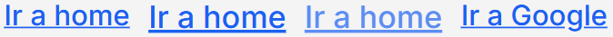

```tsx
'use client';

import Link from 'next/link';
import { useRouter } from 'next/navigation';

export default function MyComponent() {
  const router = useRouter();

  const onClickNavigation = (): void => {
    router.push('/home');
  };

  return (
    <>
      <Link href='/home' className='btn btn-link'>
        Ir a home
      </Link>

      <button className='btn btn-link' onClick={onClickNavigation}>
        Ir a home
      </button>

      <button disabled className='btn btn-link' onClick={onClickNavigation}>
        Ir a home
      </button>

      <a
        className='btn btn-link'
        href='https://www.google.com'
        target='_blank'
        rel='noopener noreferrer'
      >
        Ir a Google
      </a>
    </>
  );
}
```

### Botones con Color de Fondo

`btn-background` agrega color de fondo al boton.

En sistemas de diseño modernos, los botones se clasifican según su nivel de importancia y riesgo de la acción:

| Tipo de boton    | Significado                                                    |
| ---------------- | -------------------------------------------------------------- |
| 🔵 **Primary**   | acción principal (continuar / confirmar / guardar)             |
| ⚪ **Secondary** | acción secundaria (cancelar / salir)                           |
| 👻 **Ghost**     | acción discreta sin estructura visual fuerte - no tiene border |
| 🔴 **Danger**    | eliminar o destruir                                            |
| 🟡 **Warning**   | advertencia                                                    |
| 🟢 **Success**   | confirmación positiva                                          |
| 🔷 **Info**      | información                                                    |
| 🔗 **Link**      | navegación / enlaces                                           |
| ⚫ **Dark**      | variante de alto contraste para acciones neutras o de soporte  |

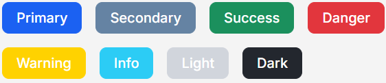

```tsx
<button className="btn btn-primary btn-background">Primary</button>
<button className="btn btn-secondary btn-background">Secondary</button>
<button className="btn btn-success btn-background">Success</button>
<button className="btn btn-danger btn-background">Danger</button>
<button className="btn btn-warning btn-background">Warning</button>
<button className="btn btn-info btn-background">Info</button>
<button className="btn btn-light btn-background">Light</button>
<button className="btn btn-dark btn-background">Dark</button>
```

### Botones con Borde + Texto

Las clases `.btn-outline-*` se usan para botones que tienen `border`, pero no color de fondo `background-color` por defecto.

El comportamiento visual depende del estado de interacción:

- **Estado normal (sin `hover`)** → sin fondo `background-color: transparent` y se muestra únicamente el `border`.

- **Estado `hover`** → botón cambia su `background-color` dependiendo del tipo de botón.

Algunos botones usan colores claros en el texto o borde, por lo que deben colocarse sobre fondos oscuros para mantener un buen contraste y asegurar que sean claramente visibles.


```tsx
<button className="btn btn-primary btn-outline">Primary</button>
<button className="btn btn-secondary btn-outline">Secondary</button>
<button className="btn btn-success btn-outline">Success</button>
<button className="btn btn-danger btn-outline">Danger</button>
<button className="btn btn-warning btn-outline">Warning</button>
<button className="btn btn-info btn-outline">Info</button>
<button className="btn btn-light btn-outline">Light</button>
<button className="btn btn-dark btn-outline">Dark</button>
```

### Botones con sombra

`btn-shadow` agrega una sombra a cualquier variante de botón, sin importar su estilo (fondo, borde o ghost).

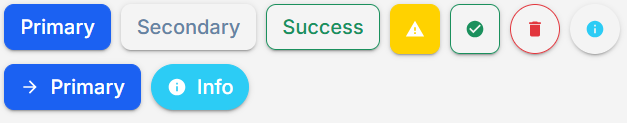

```tsx
import {
  MdWarning,
  MdCheckCircle,
  MdDelete,
  MdInfo,
  MdArrowForward,
} from "react-icons/md";

export default function MyComponent() {
  return (
    <>
      {/* sombra + fondo + texto */}
      <button className='btn btn-primary btn-background btn-shadow'>Primary</button>

      {/* sombra + texto */}
      <button className='btn btn-secondary btn-ghost btn-shadow'>Secondary</button>

      {/* sombra + borde + texto */}
      <button className='btn btn-success btn-outline btn-shadow'>Success</button>

      {/* sombra + bordes redondeados + icono + fondo */}
      <button className='btn btn-warning btn-background btn-icon-only btn-shadow'>
        <MdWarning />
      </button>

      {/* sombra + bordes redondeados + icono + borde */}
      <button className='btn btn-success btn-outline btn-icon-only btn-shadow'>
        <MdCheckCircle />
      </button>

      {/* sombra + borde + btn-rounded-full forma de circulo + icono */}
      <button className='btn btn-outline btn-danger btn-icon-only btn-rounded-full btn-shadow'>
        <MdDelete />
      </button>

      {/* sombra + btn-rounded-full forma de circulo + icono */}
      <button className='btn btn-ghost btn-info btn-icon-only btn-rounded-full btn-shadow'>
        <MdInfo />
      </button>

      {/* sombra + icono + fondo + texto */}
      <button className='btn btn-primary btn-background btn-shadow'>
        <MdArrowForward />
        <span>Primary</span>
      </button>

      {/* sombra + icono + fondo + texto + boton redondo */}
      <button className='btn btn-info btn-background btn-rounded-full btn-shadow'>
        <MdInfo />
        <span>Info</span>
      </button>
    </>
  );
}
```

### Botones con Icono

Es obligatorio que, cuando el botón contenga únicamente un icono (sin texto), se utilicen las clases `btn` y `btn-icon-only`

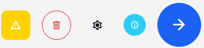

```tsx
import {
  MdWarning,
  MdDelete,
  MdSettings,
  MdInfo,
  MdArrowForward,
} from "react-icons/md";

export default function MyComponent() {
  return (
    <>
      {/* bordes redondeados */}
      <button className="btn btn-warning btn-background btn-icon-only">
        <MdWarning />
      </button>

      {/* btn-rounded-full forma de circulo */}
      <button className="btn btn-outline btn-danger btn-icon-only btn-rounded-full">
        <MdDelete />
      </button>

      <button className="btn btn-ghost btn-dark btn-icon-only btn-rounded-full">
        <MdSettings />
      </button>

      {/* xs boton muy pequeño */}
      <button className="btn btn-info btn-background btn-icon-only btn-rounded-full btn-xs">
        <MdInfo />
      </button>

      {/* 2xl boton muy grande*/}
      <button className="btn btn-primary btn-background btn-icon-only btn-rounded-full btn-2xl">
        <MdArrowForward />
      </button>
    </>
  );
}
```

### Botones con Icono + Fondo

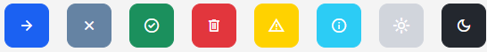

```tsx
import {
  MdArrowForward,
  MdClose,
  MdCheckCircle,
  MdDelete,
  MdWarning,
  MdInfo,
  MdLightMode,
  MdDarkMode,
} from "react-icons/md";

export default function MyComponent() {
  return (
    <>
      <button className="btn btn-primary btn-background btn-icon-only">
        <MdArrowForward />
      </button>

      <button className="btn btn-secondary btn-background btn-icon-only">
        <MdClose />
      </button>

      <button className="btn btn-success btn-background btn-icon-only">
        <MdCheckCircle />
      </button>

      <button className="btn btn-danger btn-background btn-icon-only">
        <MdDelete />
      </button>

      <button className="btn btn-warning btn-background btn-icon-only">
        <MdWarning />
      </button>

      <button className="btn btn-info btn-background btn-icon-only">
        <MdInfo />
      </button>

      <button className="btn btn-light btn-background btn-icon-only">
        <MdLightMode />
      </button>

      <button className="btn btn-dark btn-background btn-icon-only">
        <MdDarkMode />
      </button>
    </>
  );
}
```

### Botones con Borde + Icono

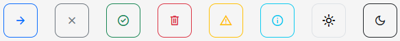

```tsx
import {
  MdArrowForward,
  MdClose,
  MdCheckCircle,
  MdDelete,
  MdWarning,
  MdInfo,
  MdLightMode,
  MdDarkMode,
} from "react-icons/md";

export default function MyComponent() {
  return (
    <>
      <button className="btn btn-primary btn-outline btn-icon-only">
        <MdArrowForward />
      </button>

      <button className="btn btn-secondary btn-outline btn-icon-only">
        <MdClose />
      </button>

      <button className="btn btn-success btn-outline btn-icon-only">
        <MdCheckCircle />
      </button>

      <button className="btn btn-danger btn-outline btn-icon-only">
        <MdDelete />
      </button>

      <button className="btn btn-warning btn-outline btn-icon-only">
        <MdWarning />
      </button>

      <button className="btn btn-info btn-outline btn-icon-only">
        <MdInfo />
      </button>

      <button className="btn btn-light btn-outline btn-icon-only">
        <MdLightMode />
      </button>

      <button className="btn btn-dark btn-outline btn-icon-only">
        <MdDarkMode />
      </button>
    </>
  );
}
```

### Botones con Icono + Fondo + Texto

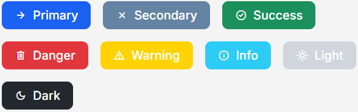

```tsx
import {
  MdArrowForward,
  MdClose,
  MdCheckCircle,
  MdDelete,
  MdWarning,
  MdInfo,
  MdLightMode,
  MdDarkMode,
} from "react-icons/md";

export default function MyComponent() {
  return (
    <>
      <button className="btn btn-primary btn-background">
        <MdArrowForward />
        <span>Primary</span>
      </button>

      <button className="btn btn-secondary btn-background">
        <MdClose />
        <span>Secondary</span>
      </button>

      <button className="btn btn-success btn-background">
        <MdCheckCircle />
        <span>Success</span>
      </button>

      <button className="btn btn-danger btn-background">
        <MdDelete />
        <span>Danger</span>
      </button>

      <button className="btn btn-warning btn-background">
        <MdWarning />
        <span>Warning</span>
      </button>

      <button className="btn btn-info btn-background">
        <MdInfo />
        <span>Info</span>
      </button>

      <button className="btn btn-light btn-background">
        <MdLightMode />
        <span>Light</span>
      </button>

      <button className="btn btn-dark btn-background">
        <MdDarkMode />
        <span>Dark</span>
      </button>
    </>
  );
}
```

### Botones Redondos

`btn-rounded-full` redondea al maximo las esquinas de cualquier tipo de boton

| Tipo de botón  | Condición (dimensiones) | Resultado visual                                  |
|----------------|-------------------------|---------------------------------------------------|
| Rectangular    | width ≠ height          | Esquinas totalmente redondeadas (forma alargada)  |
| Cuadrado       | width = height          | Círculo perfecto (no óvalo)                       |

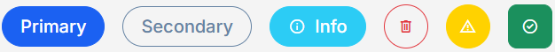

```tsx
import {
  MdInfo,
  MdDelete,
  MdWarning,
  MdCheckCircle,
} from "react-icons/md";

export default function MyComponent() {
  return (
    <>
      <button className="btn btn-primary btn-background btn-rounded-full">
        Primary
      </button>

      <button className="btn btn-secondary btn-outline btn-rounded-full">
        Secondary
      </button>

      <button className="btn btn-info btn-background btn-rounded-full">
        <MdInfo />
        <span>Info</span>
      </button>

      <button className="btn btn-outline btn-danger btn-icon-only btn-rounded-full">
        <MdDelete />
      </button>

      <button className="btn btn-background btn-warning btn-icon-only btn-rounded-full">
        <MdWarning />
      </button>

      {/* SIN btn-rounded-full tiene esquinas redondeadas */}
      <button className="btn btn-background btn-success btn-icon-only">
        <MdCheckCircle />
      </button>
    </>
  );
}
```

### Botones sin Fondo ni Borde

`btn-ghost` tiene las siguientes características:

- **Fondo:** transparente.
- **Borde:** inexistente.
- **Color:** usa los mismos colores de las variantes (primary, secondary, success, etc).
- **Hover:** Cambia color de fondo al situar mouse en boton.
- **Uso:** acciones secundarias o discretas.

***NO hover***


***hover***

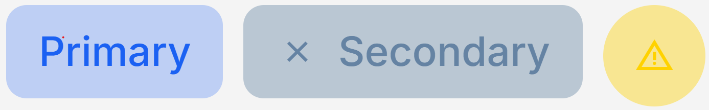

```tsx
import { MdClose, MdWarning } from "react-icons/md";

export default function MyComponent() {
  return (
    <>
      <button className="btn btn-primary btn-ghost">
        Primary
      </button>

      <button className="btn btn-secondary btn-ghost">
        <MdClose />
        <span>Secondary</span>
      </button>

      <button className="btn btn-warning btn-ghost btn-icon-only btn-rounded-full">
        <MdWarning />
      </button>
    </>
  );
}
```

### 🚫 Boton desactivado `cursor: not-allowed`

Agregar el atributo booleano de HTML `disabled` a la etiqueta `<button>` hace que los botones tomen estilos de desactivados.

El estilo de boton desactivado se aplica a cualquier tipo de boton.

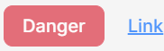

```tsx
'use client';

import {
  MdDelete,
  MdWarning,
  MdInfo,
  MdDarkMode,
} from "react-icons/md";

export default function MyComponent() {
  const router = useRouter();

  const onClickNavigation = (): void => {
    router.push('/home');
  };

  return (
    <>
      <button disabled className="btn btn-primary btn-background">
        Primary
      </button>

      <button disabled className="btn btn-secondary btn-outline">
        Secondary
      </button>

      <button disabled className="btn btn-icon-only btn-outline btn-danger btn-rounded-full">
        <MdDelete />
      </button>

      <button disabled className="btn btn-icon-only btn-warning btn-background">
        <MdWarning />
      </button>

      <button disabled className="btn btn-icon-only btn-outline btn-info">
        <MdInfo />
      </button>

      <button disabled className="btn btn-dark btn-background">
        <MdDarkMode />
        <span>Dark</span>
      </button>

      {/* Enlaces */}
      <button disabled className='btn btn-link' onClick={onClickNavigation}>
        Ir a home
      </button>
    </>
  );
}
```

### 📐 Tamaños

Puedes modificar el tamaño de cualquier variante de botón, sin importar su estilo (fondo, borde o ghost).

El ajuste de tamaño se aplica a todo el boton y afecta de manera proporcional a todos sus elementos internos:

- Tamaño del botón `padding`.

- Tamaño del texto `font-size`.

- Tamaño de los iconos.

- El espacio entre el icono y el texto `gap` es proporcional al tamaño del botón, ya que utiliza la unidad de medida `em`, la cual depende del `font-size` del propio botón.

El tamaño por defecto de todos los botones es `.btn-base`:

Esto significa que no es necesario declararlo explícitamente: si no se especifica un modificador de tamaño, el botón siempre asumirá este estilo automáticamente.

```SCSS
.btn-base {
  padding: 0.5rem 1rem;         // py-2 = 0.5rem = 8px, px-3 = 0.75rem = 12px

  font-size: 1rem;              // text-base = 1rem = 16px
  line-height: calc(1.2 / 1);   // (line-height que se desea aplicar / font-size)
}
```


```tsx
import {
  MdCheckCircle,
  MdDelete,
  MdWarning,
  MdRocketLaunch,
} from "react-icons/md";

export default function MyComponent() {
  return (
    <>
      <button className="btn btn-primary btn-background btn-xs">
        Muy pequeño
      </button>

      <button className="btn btn-secondary btn-outline btn-sm">
        Pequeño
      </button>

      <button className="btn btn-secondary btn-outline">
        Valor por defecto
      </button>

      <button className="btn btn-secondary btn-outline btn-base">
        Valor por defecto
      </button>

      <button className="btn btn-success btn-background btn-lg">
        <MdCheckCircle />
        <span>Grande</span>
      </button>

      <button className="btn btn-danger btn-outline btn-xl">
        <MdDelete />
        <span>Muy grande</span>
      </button>

      <button className="btn btn-warning btn-background btn-2xl">
        <MdWarning />
        <span>Enorme</span>
      </button>

      <button className="btn btn-info btn-background btn-3xl">
        <MdRocketLaunch />
        <span>Gigante</span>
      </button>
    </>
  );
}
```

### Modificadores - Boton en Bloque - Responsive

En CSS un elemento en bloque es aquel que ocupa todo el ancho disponible de su contenedor y siempre inicia en una nueva línea ("renglon")

```SCSS
.block {
  display: block;
}
```

```SCSS
.flex {
  display: flex;
}
```

`btn-full-width` convierte el boton a elemento en bloque, hace que el boton ocupe todo al ancho disponible de su contenedor padre y es responsive

Funciona para cualquier variante de botón, sin importar su estilo (fondo, borde o ghost).

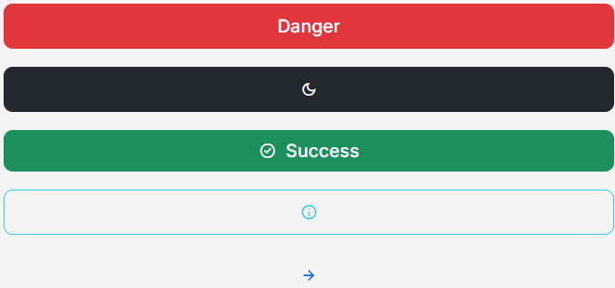

```tsx
import {
  MdDarkMode,
  MdCheckCircle,
  MdInfo,
  MdArrowForward,
} from "react-icons/md";

export default function MyComponent() {
  return (
    <>
      {/* solo texto */}
      <button className="btn btn-danger btn-background btn-full-width">
        Danger
      </button>

      {/* solo icono + fondo */}
      <button className="btn btn-dark btn-background btn-icon-only btn-full-width">
        <MdDarkMode />
      </button>

      {/* icono + fondo + texto */}
      <button className="btn btn-success btn-background btn-full-width">
        <MdCheckCircle />
        <span>Success</span>
      </button>

      {/* icono + borde */}
      <button className="btn btn-outline btn-info btn-icon-only btn-full-width">
        <MdInfo />
      </button>

      {/* sin fondo ni borde */}
      <button className="btn btn-primary btn-icon-only btn-ghost btn-full-width">
        <MdArrowForward />
      </button>
    </>
  );
}
```

### Ubicación de Iconos y Texto en Botones

**❌ Incorrecto:**

Usar [flex-direction](https://tailwindcss.com/docs/flex-direction) para cambiar ubicacion de iconos:

```tsx
import { MdArrowForward } from "react-icons/md";

export default function MyComponent() {
  return (
      <button className="btn btn-primary btn-background flex-row-reverse">
        <MdArrowForward />
        <span>Primary</span>
      </button>
  );
}
```

**✅ Correcto:**

Cambiar la ubicación del icono y texto en el HTML, sin usar Sass ni Tailwind.

*icono a la izquierda - texto a la derecha*


```tsx
import { MdArrowForward } from "react-icons/md";

export default function MyComponent() {
  return (
      <button className="btn btn-primary btn-background">
        <MdArrowForward />
        <span>Primary</span>
      </button>
  );
}
```

*icono a la derecha - texto a la izquierda*

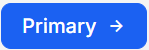

```tsx
import { MdArrowForward } from "react-icons/md";

export default function MyComponent() {
  return (
      <button className="btn btn-primary btn-background">
        <span>Primary</span>
         <MdArrowForward />
      </button>
  );
}
```
